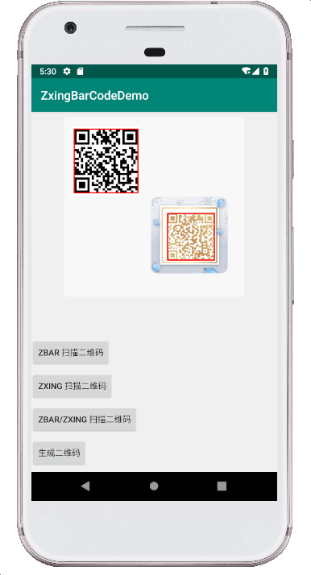
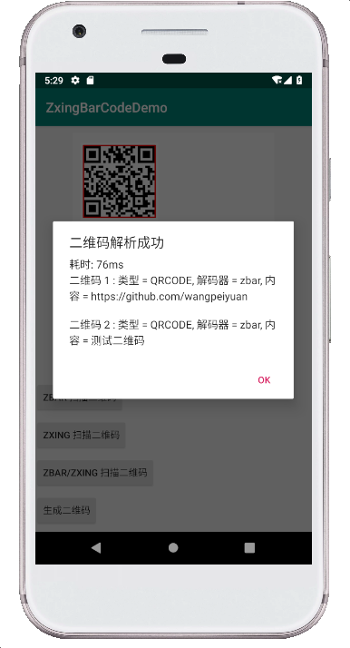
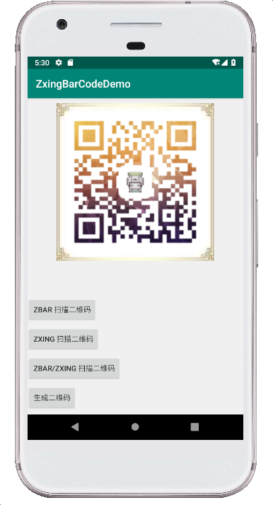

##  ZxingBarCode

## Introduction

An Android library to scanner and generate barcode based on ZXing and ZBar.

## Screenshots





## Features

* 支持扫描图片中的条形码（包含多个），可选择使用 ZXing 或 ZBar，默认先使用 ZBar 失败之后再使用 ZXing，以此来提高识别的成功率
* 支持生成自定义宽高、自定义颜色、设置 logo、背景图片等个性化的二维码

## Getting started

在项目的 `build.gradle` 中添加
```
dependencies {
    implementation ''//Waiting
}
```

## Usage

### 图片解析

使用 `ZxingBarCode.decodeCodeBar`

参数说明：

属性名 | 说明 
:----------- | :----------- 
imageLocalPath | 图片本地地址
bitmap | bitmap
data | bitmap 的 byte[]
isMulti | true 支持解析多个，false 返回第一个解析到结果
decoderListener | 
decodeType | 解析器的类型 `ZBar/ZXing/Both`

可以使用 `ZxingBarCode.setMaxBitmapSize` 来限制图片的大小减少内存，如果只解析二维码的话可以设置 `ZxingBarCode.setOnlyQRCode` 加快解析速度

当然也可以使用 `ZBarDecoder` 和 `ZXingDecoder` 自定义使用

### 二维码生成

使用 `ZxingBarCode.encodeQRCode`

`QRCodeParams` 参数说明

属性名 | 说明 
:----------- | :----------- 
content | 二维码内容
width | 宽度
height | 高度
margin | 边缘空白边距
bgColor | 背景颜色，默认白色
preColor | 信息部分的颜色，默认黑色
preBitmap | 目标图片 (preBitmap != null, 黑色色块将会被该图片像素色值替代)，选用的Bitmap图片一定不能有白色色块,否则会识别不出来
logoInfo | logo 图片信息
backgroundInfo | 背景图片信息

`LogoInfo` 参数说明

属性名 | 说明 
:----------- | :----------- 
logoBitmap | logo 图片
paddingWhite | logo 边缘的白色大小
round | logo 边缘的白色弧度
strokeColor | logo 边框颜色，默认无

`BackgroundInfo` 参数说明

属性名 | 说明 
:----------- | :----------- 
bgBitmap | 背景图片
barCodeLeft | 条形码在背景图左边顶点
barCodeTop | 条形码在背景图上边顶点
barCodeAlpha | 条形码的透明度 0 ~ 100，默认 100

## TODO

- [ ] 优化 ARGB 转换 YUV 的速度
- [ ] 增加相机扫描（不确定是否要）

## Thanks

大部分代码基于以下第三方库

1. [barcodescanner](https://github.com/dm77/barcodescanner) 
2. [zxing](https://github.com/zxing/zxing) 

## License

Apache License, Version 2.0
